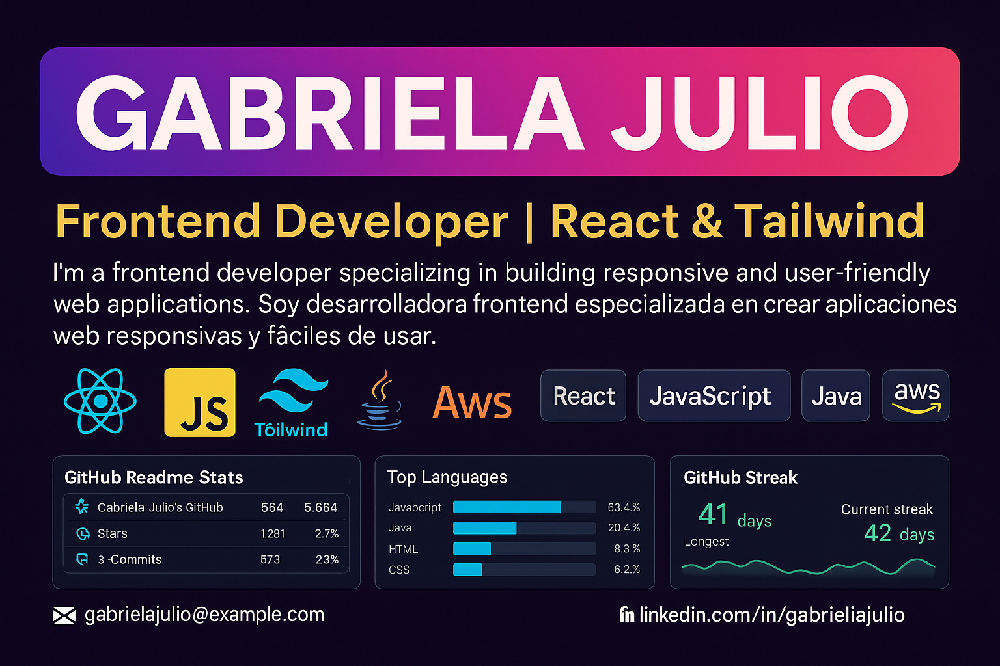

<!--
Perfil de GitHub - Gabriela Julio Duarte
Estilo: oscuro, llamativo. Bilingüe (ES/EN).
-->

  

# 👋 ¡Hola! Soy **Gabriela Julio Duarte**
**Full Stack Developer | Frontend-Oriented**  
📍 Bogotá, Colombia &nbsp;•&nbsp; 🌎 Remoto / Híbrido

Soy desarrolladora con más de **3 años de experiencia** construyendo interfaces rápidas, accesibles y escalables con **React, Next.js y Node.js**. Me apasiona crear productos útiles, colaborar con equipos ágiles y mejorar la DX (developer experience).

### 🚀 Tech Stack

### 💡 Sobre mí
- 🎓 Ingeniera de Sistemas (UNIMINUTO). Inglés **B2**.  
- 🧩 Experta en **microservicios, REST/GraphQL**, y **CI/CD** con GitHub Actions y Docker.  
- 📈 Me enfocó en **performance**, **accesibilidad** y **buenas prácticas** (SOLID, Clean Architecture, TDD).  
- ✨ Objetivo 2025: aportar a productos con impacto y seguir creciendo como **Frontend** con **React/Next.js**.

### 🧪 En qué estoy trabajando
- Repos públicos en preparación (portafolio, componentes UI, proyectos full‑stack).  
  > Si te interesa colaborar, ¡escríbeme!

---

## 📊 Estadísticas

  

  

  

---

## 📫 Contacto | Contact

---

## 🇬🇧 English
**Full Stack Developer (Frontend‑Oriented)** based in Bogotá, Colombia.  
I build fast and accessible web apps with **React, Next.js, Node.js**, and AWS. Strong focus on code quality, DX, and product impact.

**Tech:** React • Next.js • TypeScript • Node.js • Tailwind CSS • AWS • Docker • REST/GraphQL • CI/CD  
**Reach me:** *Replace with your* LinkedIn *and* Email *above*.

---
> *“La programación no es solo código: es transformar ideas en experiencias útiles.”*
